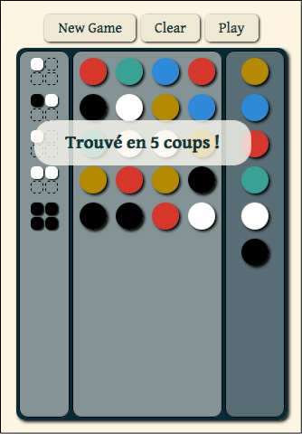

Simple Mastermind
=================

A simple web version of the famous board game [Mastermind][Mastermindwikipedia].

**[Play it here!](http://lenaindelaforetmagique.github.io/MasterMind/)**

Controls
--------

- Click or touch the code pegs on the right to compose a combination guess.
- Submit it with the button _Play_.
- Correct it with the button _Clear_

Screenshot!
-----------

License
=======

_Simple Mastermind_ is licensed under the [MIT License](LICENSE.txt). Distribute and modify at will!

A lot of things were inspired and copied from [Eltzi's Tetris 2048][Eltzi], MIT License.

Gentium Book Basic font from [Google Fonts](https://www.google.com/fonts/specimen/Gentium+Book+Basic), distributed under the [SIL Open Font License, 1.1](http://scripts.sil.org/cms/scripts/page.php?site_id=nrsi&id=OFL).

[Mastermindwikipedia]:https://en.wikipedia.org/wiki/Mastermind_(board_game)
[Eltzi]: https://github.com/castux/eltzi/
